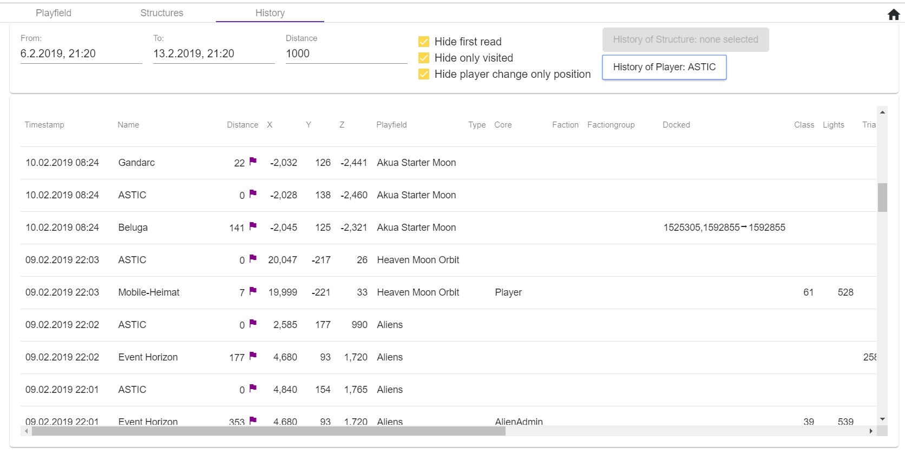
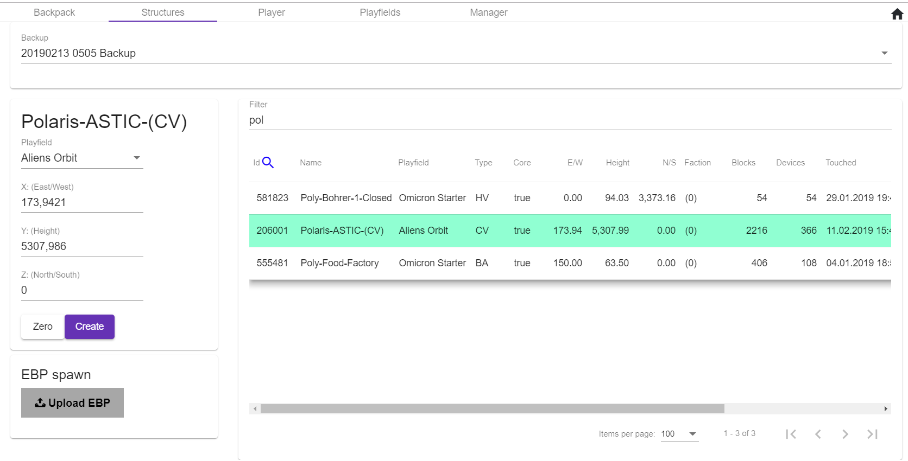

# Empyrion Web Access
 

# English Version

# Empyrion Web Access

## What's this?
Empyrion Web Access is a MOD that allows access to the game as an admin via a web browser.
The fact that the MOD gets along without a surface or remote desktop on the server, it is also suitable for use with game host.
It starts and ends automatically with the game and can be used by any number of admins at the same time.

Empyrion Web Access is free for non-commercial use. <br>
Donation to the original creator: https://paypal.me/ASTICTC

Have fun playing and server operation wishes
ASTIC/TC

## installation
* Extract the Content of the ZIP file into the directory "\\Empyrion-Dedicated Server\\Content\\Mods"

* When start the Empyrion Dedicated Server the file "xstart.txt"will be created in the savegame directory \[Savegame\]\\Mods\\EWA. Where "Savegame" is your game savegame name.

* Shut down the Server and rename the "xstart.txt" to "start.txt". When the Server is restarted,
the Ewa-Loader should be ready for use.
* 

* !!! IMPORTANT !!! EmpyrionWebAccess does not start automatically. The "start.txt" file must always be located in the directory \[Savegame\]\\MODs\\EWA.
* If you want to switch off the EWA again it is enough to change the "start.txt" into "xstart.txt" again.


# Web server configuration
By default, the EWA can be reached at https://\[computer name\].

If this should happen on another port or url the text file "appsettings.json" must be in
Savegame directory can be configured under \[Savegame\]\\MODs\\EWA.
Several server URLs are suggested - under Http and HttpsDefaultCert only one entry "Url" may remain uncommented
other MUST be commented out by //.

Note: The web server runs exclusively via HTTPS and uses the HTTP only for forwarding to HTTPS.

## First login
When starting the EGS server, Empyrion Web Access should display a login mask under the selected ServerURL.

As the first user, the abbreviation and password are automatically stored and accepted in the user database. All users can be subsequently created, changed or deleted via the interface.

Note: Since the EWA's HTTPS certificate is self-signed, the browser displays a warning that the connection is not secure. This can be ignored here.
## The main window
### System/Game Information
Top right information about the server (CPU, RAM, HDD), the game (online players, number of Playfield servers, the reserve server and their memory consumption) and the version is displayed.
Also under the three right-most points is the menu for further windows and the logout.

### chat area
Here are all the chat messages of the game. The admin can also place chat messages in the game from here by entering the text in the "Message" input field and confirming with Enter/Return. If the check mark "Chat as NNNN" is set, an NNNN: is automatically set for the players in the game before the chat message.

To chat directly with a player, you can select it with the chat icon. Its name is then displayed below the input field. To be able to chat again with all players then simply the hook at "Chat to all" be set again.

### Active playfields and the players who are in it
Here the active playfields are listed with their name and number of players.
Players are shown with faction and name.

The chat symbol is used to make direct contact with the player and to save the flag symbol, its current position (see Warp).

### The list of known players
Here are all players displayed that were in the runtime of EWA times online and their PLY file is still in the savegame.

The player is shown here with his online status, name, faction, origin ...
* The chat symbol is used to make direct contact with the player and to save the flag symbol, its current position (see Warp).
* The warp icon (gamepad icon) is used to bring up the Warp window for the player to change the position of the player in the game.

### Inventory display
Here the inventory of the selected player is displayed. From here you can
* Add items
* Restore an old condition of the backpack

### Player details
Here, the data of the selected player is displayed and can be changed.
Note: Still open: ban / unban and wipe

## Structures
Here are all the structures of the game listed:
* They can be teleported
* The position can be transferred to the memory for a warp
* The structures can be deleted
* The faction faction can be set to Adm, Aln, or the selected player

## Playfield
Playfield view with the structures.
Note: In order to be able to show a map of the playfield, this map.png first has to be copied from the cache of a client into the
\\MODs\\EWA\\Maps\\\[Playfield\]\\map.png
Directory are copied

## History


With this you can determine what happened in the selected period and distance from the selected object (player or structure).

## Restore
Recovery of backpacks, structures, player files and playfields from backups


Structures:


The deleted / destroyed structures of the current savegame can be restored by selecting "### Current Savegame ###" as backup

Player files:


Playfields:


## Galaxy
Here the galaxy map is displayed with the warp links and the list of orbits and planets.


## Start/Stop
EmpyrionWebAccess does not start automatically there must be a "start.txt" file in the directory \[Savegame\]\\MODs\\EWA.
If this file is missing, the EWA is automatically stopped or not even started.

## Server Settings
* Welcome message for new players at {0} will use the name of the new player
* Startup batch for the EGS server
* Start, Stop, Restart the EGS server with a selectable early warning time
* Shut down EGS and EWA - Attention: EGS must then be started by another route

### Update EWA
Simply select the EWALoaderXYZ.zip file of the new version for upload. The upload starts automatically.
Depending on whether the EGS server is running, the EWA is first updated and then the EWALoaderClient is refreshed the next time the EGS is stopped
otherwise the EWALoaderClient will be updated first and then the EWA will be updated when the EGS server is started.

## Mod Manager
First, the ModLoader must be installed. Then the desired mods can be installed by upload.
Note: To apply changes to the mods, the ModLoader must be stopped and restarted.
In the meantime, all installed ModLoader mods are unreachable from the game.

* If necessary, the ModLoader can also be uninstalled with all its mods.
* If necessary, the modloader can be updated from the EWA package.

### Supported MOD files
* A simple dll
* A ZIP file with the files of a mod and their subdirectories - if necessary, the correct DLL must be selected here

# Advanced configuration
## Use LetsEncrypt service
LetsEncrypt provides a free and free way for fully valid HTTPS certificates
The service does not require login or registration but can be accessed by 'web servers'.
be dynamically asked for a certificate. This happens as well as we update
same automatically.
For security, you can still deposit his email address. LetsEncrypt then sends a notification email before the expiration of a certificate.

Make the following entry in 'appconfig.json' in \[savegame\]\\MODs\\EWA

```
  "LetsEncryptACME": {
    "UseLetsEncrypt": true,
    "DomainToUse": "{ComputerName}",
    "EmailAddress": "email@example.com",
    "CountryName": "Country",
    "Locality": "language",
    "Organization": "your Organization",
    "OrganizationUnit": "your Organization Unit",
    "State": "state"
  },
```

Note: LetEncrpyt currently only works with the stanadard ports 80 or 443.

# Advanced configuration
## Create your own self-signed certificate for the HTTPS connection
The EWA already contains a self-signed certificate. But you can also make your own with PowerShell:

1. New-SelfSignedCertificate -certstorelocation cert: \localmachine \my -dnsname EmpyrionWebAccess -NotAfter (get-date) .AddYears (10)
-> CE0976529B02DE058C9CB2C0E64AD79DAFB18CF4
1. $ pwd = ConvertTo-SecureString -String "Pa $$ w0rd" -Force -AsPlainText
Export-PfxCertificate -cert cert: \localMachine \my \CE0976529B02DE058C9CB2C0E64AD79DAFB18CF4 -FilePath EmpyrionWebAccess.pfx -Password $ pwd
1. Now the EmpyrionWebAccess.pfx file must be placed on the server and the file path and the password in the appsettings.json file in the \[Savegame\]\\MODs\\EWA directory must be entered

## Release of ports
Possibly. the ports and addresses must still be released for the user under whose EGS account is running. To do this, you need to issue the following commands in an Admin PowerShel Console.

1. For HTTP
   * netsh http add urlacl url = http://[computername] [: port]/user = [domain/computer]\[user]
   * netsh http add urlacl url = http://[ipaddress] [: port]/user = [domain/computer]\[user]
1. For HTTPS
   * netsh http add urlacl url = https://[computername] [: port]/user = [domain/computer]\[user]
   * netsh http add urlacl url = https://[ipaddress] [: port]/user = [domain/computer]\[user]


# Further information and the source code can be found here
https://github.com/GitHub-TC/EmpyrionWebAccess

The internal plugins work with
Is similiar to the original EmpyrionAPITools - only with async await and .NET 4.6 <br>
https://github.com/GitHub-TC/EmpyrionNetAPIAccess

mod managing via <br>
https://github.com/GitHub-TC/EmpyrionModHost

# What else is coming?
* VirtualAutominer 
* ChatBot supportcommands
* ...
* what else do we need :-)
